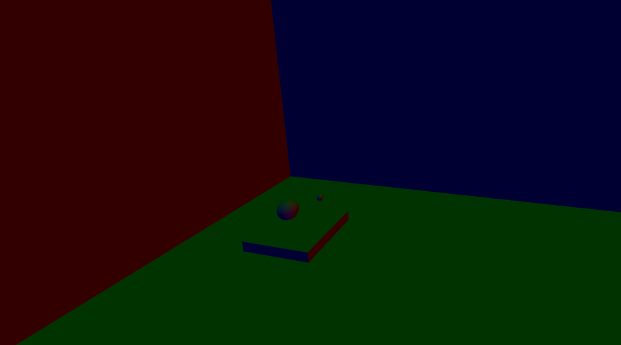
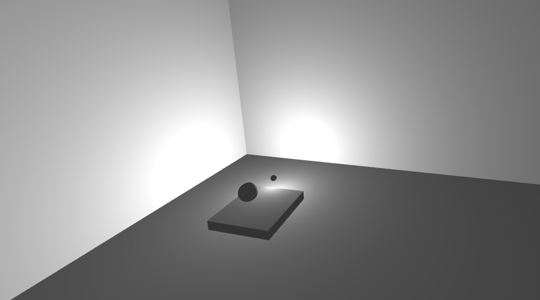
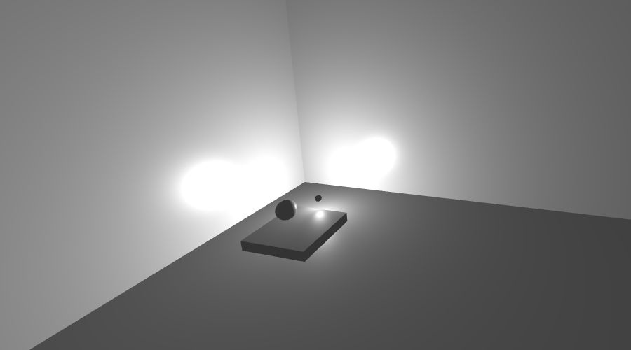
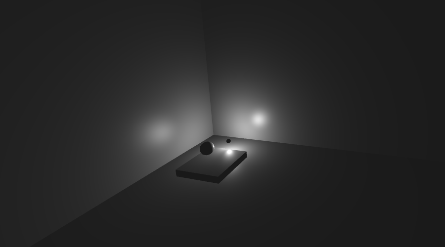
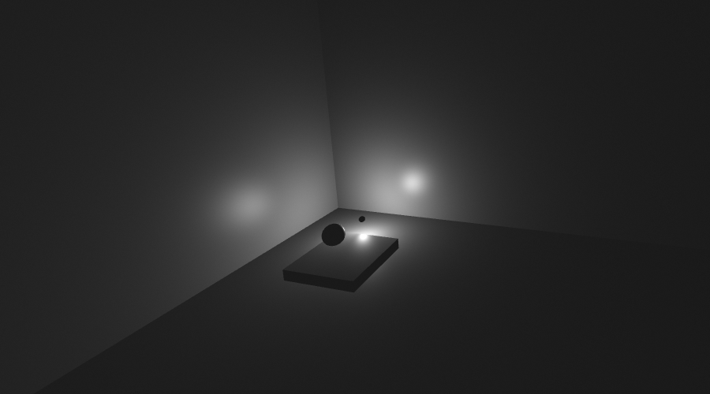
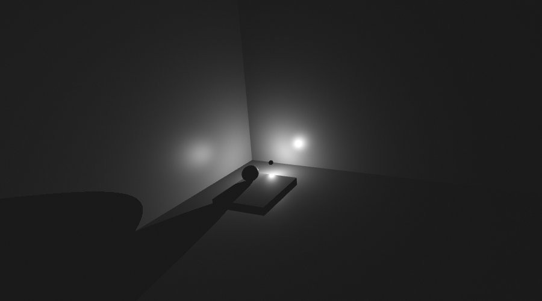
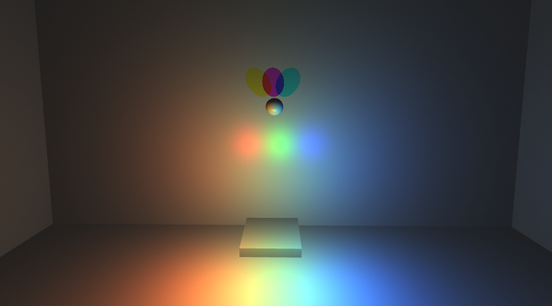

\clearpage
# Task 1 {-}

## (f) Ambient {-}

The lights location has no effect on the ambient light. For this task the normal of the surfaces are used for their color to tell them apart, for all subsequent tasks the color is white for all objects in the scene. I implemented it such that the ambient light is a combination of all the light colors in the scene. In other words, if there is only single a red lightsource, the ambient light will also be red.

## (g) Diffuse {-}

## (i) Specular Highlights{-}

# Task 2 {-}

## (a) Attenuation {-}

## (b) Dithering {-}

## (c) Shadows {-}

# Task 3 {-}

## (b) Coloured Lights {-}

# Task 4 {-}

