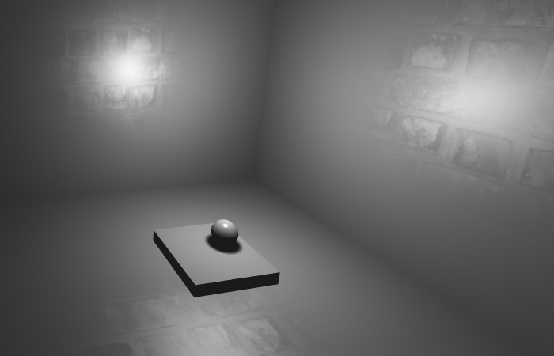

\clearpage
# Task 1 {-}

## (k) {-}

I decided to use an Orthogonal Matrix where the coordinates are from 0 to 1 with (0, 0) being the bottom left corner.

\clearpage
# Task 2 {-}

## (a) {-}

**What is the primary cause for interpolation to be non-linear, and why would a rendered image with linear interpolation of texture coordinates look incorrect?**

The primary cause for interpolation to be non-linear is to create smooth transitions between more than two points, which is often what we want/need.

An image rendered using linear interpolation would not look correct because the perspective of the textures would be lost. This is demonstrated below in [@fig:task2a]:

:::{#fig:task2a}
{#fig:task2a1 width=30%}\  
{#fig:task2a2 width=30%}\

Comparison of rendering with linear or with non-linear interpolation.
:::

## (b) {-}

**Why would a displacement map be an inappropriate thing to use if we wanted more detailed features in the walls of the scene in this assignment?**

Displacement Maps take the original mesh (or vertices) and, surprise surprise, displaces them. In other words it shift the vertices positions according to the values in the displacement map. For our scene, where the walls are created by a staggering 2 triangles, the displacement map would only displace the vertices of these two triangles. All this would do is make it look like the walls were built by two different people who started building in different directions and tried to merge it into a single wall in the middle. A proper displacement is illustreated in [@fig:task2b], where we notice how even though we start with a rectangle, it is constructed of a lot of triangles.

{#fig:task2b width=20%}

\clearpage
**In what way would we have to change the scene/meshes in order to reap a benefit from using a displacement map?**

To reap the benefits of a displacement map we would have to increase the number of vertices in the mesh for the walls. In other words split our two triangles into a lot more triangles. Not only does this sound like a real pain to do manually, but greatly increasing the vertex count of everything would also start to affect performance. This is why games (where high framerates are desired) usually use normal maps instead of displacement maps for smaller or ''flat'' objects.

## (c) {-}

**Consider a texture which is cut in half vertically, whose left side is completely red, and the right side green. The red side of the texture is now mapped on to two triangles forming a rectangle. Close to the camera, this red rectangle renders exactly as you’d expect it to. However, when moved far away instead, a downside of mipmaps becomes visible. What visual artefact would you expect to see, and why does that happen?**

The mipmapping will cause the colors of the two ractangles to start blending, for scenes with a lot of small triangles this effect can look quite natural, but as described here, i would imagine the two triangles in the middle (the rightmost red triangle, and the leftmost green triangle) will start to merge colours before the outer triangles. in essence we would, instead of seeing two rectangles, start to see 1 red triangle, 1 parallellogram, and 1 green triangle. And if its very very far away, it will look like a single rectangle.

\clearpage
# Task 3 {-}

## (f) {-}

## (i) {-}

## (j) {-}

# Task 4 {-}

## Rough around the edges. {-}

