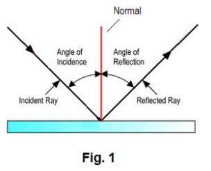
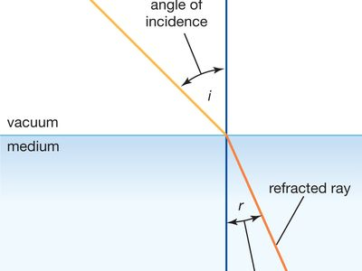
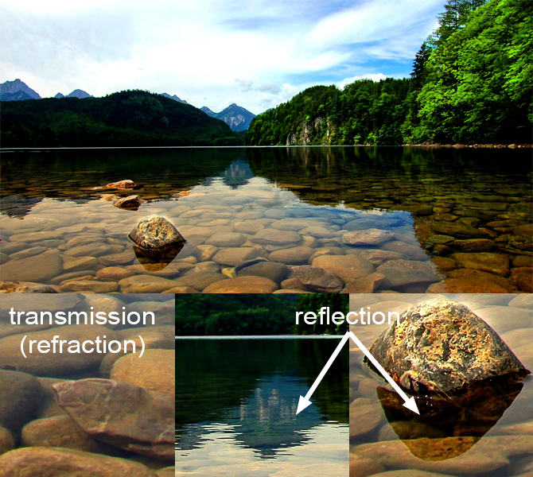
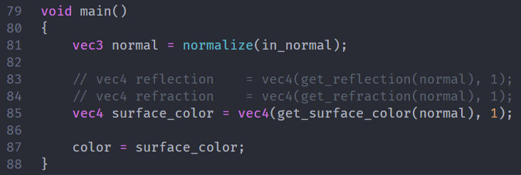
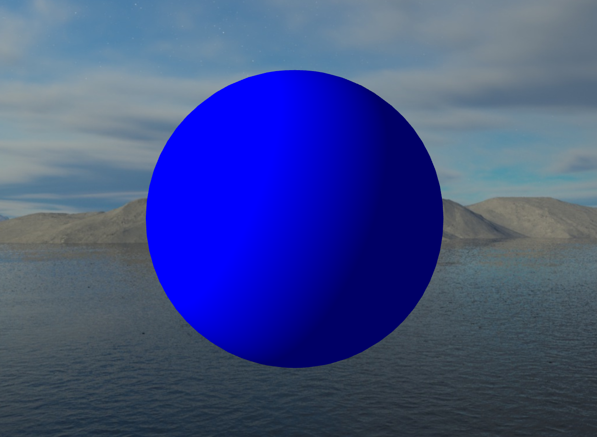
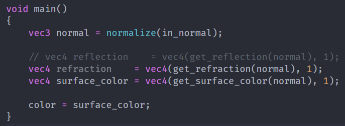
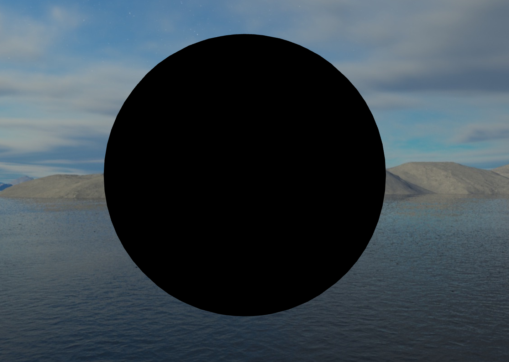

<!-- Briefly describe your project topic. -->
# Project Description

My initial idea for this project was to create as realistic light behavior as possible. This would include light reflection, refraction and dispersion where I would have multiple light sources and the light would be refracted and reflected for all objects in the scene. So in essence, I wanted to perform Ray-Tracing. However I didn't actually want to implement it by tracing each ray, but look into alternative ways to achieve comparable results. The final iteration of the project achieves semi-realistic reflections, refractions and dispersion (chromatic aberration) using dynamic cubemaps and framebuffers. This is classic approach when ray-tracing is too expensive.

The approach is for instance used for [reflections in the game GTA 5](https://www.adriancourreges.com/blog/2015/11/02/gta-v-graphics-study/) which I will use as an example throughout this report.

<!-- How does your implementation achieve its goal? -->
# Implementation

## The Skybox

Implementing a skybox is relatively simple. To do this you create a CubeMap Texture with the different faces of the skybox. A CubeMap is simply a 2D texture, but instead of only being able to sample it using *x* and *y* coordinates, you can sample it in all directions, hence the name cube. An example of such a cubemap texture is shown in [@fig:theory-cubemap]. When drawing the skybox you just have to make sure to either draw it first with depth testing disabled (my approach), or draw it last, making sure that the dimensions of the cube are further away than any geometry in the scene.

{#fig:theory-cubemap width=50%}

## Reflection

Basic reflection is the easiest of the light behaviors to achieve. To reflect only the skybox all you need is to calculate the direction of the refracted ray at a given fragments position using its normal vector. This direction can then be used to sample from the skybox's cubemap texture. Reflection of the skybox is shown in [@fig:skybox-reflection].

{#fig:theory-reflection width=50%}

## Refraction

Refraction is done in almost exactly the same way as reflection, only using a different formula for getting the ray direction. Here the materials refraction index is used to determine how much the light will bend as it enters the object. Refraction of the skybox is shown in [@fig:skybox-refraction].

{#fig:theory-refraction width=50%}

### Fresnel

The fresnel effect is an effect that occurs for all objects light can pass through, and is the effect that light is both reflected and refracted on the same object. An easy example for this is when you are standing on the shore of a quiet lake, looking straight down you see through the water, but as you look towards the horizon the water turns reflective (as shown in [@fig:theory-fresnel]).

{#fig:theory-fresnel width=50%}

An accurate fresnel effect is quite complicated and time consuming to compute, as the behavior is quite complex. I instead simplified this to simply use a ratio based on the normal vector of the surface and the ray going from the fragment into the camera. To visualize the effect I am in [@fig:fresnel-viz] demonstrating how the reflection of the skybox will be applied on top of the refraction. [@fig:fresnel] shows the end result of using fresnel in my project, notice how the top of the shoulders now reflect the sky, instead of refracting the water below.

### Chromatic Aberration

Chromatic aberration is a form of light dispersion. Light dispersion is caused by the different wavelength (colors) of light having slightly different refraction indexes. This is what causes white light to turn into a rainbow when reflected of rain, or refracted through glass (shown in [@fig:theory-chrome]).

{#fig:theory-chrome width=50%}

To implement this I slightly offset each color channel's (RGB) refraction ray. Applying this again to the same model in [@fig:dispersion] you can notice how the edges of the refracted mountains get a rainbow effect. The effect is subtle, but adds to the realism of glass objects when moving around in the scene. The effect gets more apparent the more the light is refracted, and the brighter the light is.

## Frame Buffers

My implementation relies heavily on the use of FrameBuffers. A Framebuffer is in essence a collection of buffers used to render the scene, among these are the color and depth buffers. by manually creating extra framebuffers you can tell OpenGL to render to these instead of the one used for the screen. This render can then be saved as textures that you can sample from afterwards.

To create accurate reflections and refraction that include the objects in the scene, each object in my scene has its own framebuffer (which has a cubemap texture). When rendering the scene, the scene is rendered 6 times per reflective/refractive object to create a cubemap of the scene for that particular object. In [@fig:cubemap] you can see the difference between the skybox faces, and the dynamically created cubemap faces for one such reflective object.

The great thing about all objects storing their own cubemaps, is that they keep this cubemap for the next frame. This means when creating the next frame, object A wants to create its updated cubemap and renders the scene. When doing that object B will use the cubemap they created last frame, which now contain a reflection of object A, this repeats when object B refreshes its cubemap and so on. On the scene this has the effect of light bouncing back and forth between reflective objects. This is great news as this means we essentially get infinite "ray bounces" (or alteast as far back as the number of frames has been rendered), without additional rendering cost. Of course creating a cubemap for each object isn't free, but this will be discussed in the "Limitations and Advantages" Section.

The final result can be seen in [@fig:result].

## Extras

I have a tendency to get sidetracked when working on larger projects, but thought i would at least mention some of the other things implemented in my scene, that is not directly related to my project description.

- Screenshot capabilities.
- FPS camera with zoom on scroll.
- **.gltf** Model Loader using *cgltf*.
- Dynamic Skybox switching.

<!-- What are some notable problems you encountered on the way? How did you solve them? -->
# Problems

## Implementation Problems

My implentation workflow usually followed the path of:

- Look at a tutorial for an effect.
- Thinking that it will be quick and/or easy to implement.
- Implement it over 1 day and get weird results.
- Spend 2 days debugging why the results are weird.
- Find tiny bug in code, fix it, results looks great again.

One of the most obvious cases of this was after I implemented the dynamic cubemaps, and for some reason the right and left faces of the cubemap didn't align properly with the rest of the cubemap, ruining the appearance of reflections/refractions. After two days of debugging and refactoring, I realized I never changed the aspect ratio of my perspective matrix correctly, I only changed the FOV.

All these bugs and annoyances cost me a fair bit of time, which is a shame as that kept me from finishing my implementation of double refraction. Since I don't simulate the rays I had to find a way to not only figure out the refraction of the light as it hits the object, but also when it leaves it. My first thought was that if I simply perform refraction when creating the dynamic cubemap, by switching from back-face to front-face culling to see the object from the inside, it would appear as if the light was refracted two times. However the result of this looked more like the refractions were broken because all light doesn't pass through the excact center of the object. The result of attempting this approach is seen in [@fig:back-refraction-attempt] (From the best angle I might add). Thats when I discovered another approach where you render the entire scene from the cameras perspective, again using front face culling and then rendering the normals of the backside of refractive objects to a texture. When performing the final render pass this would mean you have access to both the front facing normal, and the back facing normal at each fragment position, along with the depth value of the front and back of the object. This approach is outlined in the paper listed under "Sources". However because I had spent so much time trying to fix bugs, I didn't have the time to fully implement this, although I did manage to create the texture with the back-side normals (see [@fig:back-normals]). This is really a shame because I feel like that is the only part of my scene that does not look realistic.

A smaller problem I had was that when I attempted to let an object reflect itself, it would not render anything as there wasn't anything to sample from, this is seen in [@fig:self-reflection]. Instead of finding a fix for this, I just skip rendering the object itself when creating its cubemap.

## Technical Problems

One of the most infuriating problems for me this project was not actually related to the project itself, but the fact that my computers (Bootcamp on MacOS) only compatible graphics drivers seems to dislike GLSL textures. The issue is that if I try to sample too many textures in a shader, all other geometry rendered in that shader would either turn black or 100% transparent. Working with cubemaps (that essentially are textures) this caused a fair deal of headaches. This problem cost me even more days of trying to debug, only to find out all my code was working properly, but only on other computers. The problem is visualized in [@fig:driver-issue], where you see how calling the function (the problem is that inside this function I sample the skybox an extra time) without using the result for anything changes all geometry in the scene to turn black. This increased the complexity of working on this project considerably as I had limited access/time to run my code on computers that worked properly.

<!-- What did you find out about the method in terms of its advantages, its limitations, and how
to use it effectively? -->
# Limitations and Advantages

The limitations of the way I calculate the reflections and refractions instead of raytracing, is that the result lose a bit of realism. This is perhaps most noticeable in reflections of refractions, where the refraction will appear identical from all angles because the camera that creates the cubemap never moves (unlike the actual camera position). The advantage of this approach is of course performance, in many cases the approximations appear ''good enough'' that without really analyzing it no one would be able to tell the difference.

One of the greatest limitations of the dynamic cubemap approach to reflections and refractions is the fact that each scene must be re-rendered several times to create each dynamic cubemap. If the reflection resolution is equal to the screen size, then that means the entire scene is rendered at full scale $6$ times per object $+ 1$ final render to the screen. For my scene which contains a maximum of 7 reflective/refractive objects, this means in worst case my scene would have to be rendered 43 times per frame. Lets say rendering the frame without reflections and refractions I achieve 1000*FPS*, I would now only get approximately 23*FPS*, which isn't *that* bad, but this would be comletely unmanageable in larger scenes/games with hundreds or thousands of reflective surfaces/objects.

This leads me to one of the greatest advantages of this approach, and that is that the approach is highly customizable. Customization means there is a lot of room for optimization. The most obvious one would be to reduce the resolution of the reflections, demonstrated in [@fig:low-resolution]. This is what was done in GTA V, where the reflections only had a resolution of $128\times128$ pixels. For perfect geometric shapes like the ones in my scene this reduction is quite noticeable, but in a complex scene with complex models, the decrease in resolution is in most cases negligible. Other possible optimization would be decreasing the ''refresh-rate'' of the reflections, for instance only updating the reflection every other frame, or updating only one side of the cubemap each frame. In GTA V an optimization they did was to only create and use the top side of the cubemap, cutting the cost in half, as reflections below the cars are rarely ever seen, and almost always just asphalt. It also isn't much point in updating reflections/refractions for objects far away from the camera, as the result isn't noticeable anyway. These cubemaps can also, in the case where the objects don't move much, be pre rendered or created when the scene first loads. For objects placed in approximately the same location, a cubemap can also be shared. Of course rendering the entire scene might not be necessary either, the scene can rendered without textures, reduced geometry, decrease far-clipping-plane distance etc. Applying any or all of these optimization in a smart way will in theory achieve very realstic results, without impacting the performance as much.

If I were to optimize the reflections and refractions for my scene, I would first not recalculate the top/bottom face of the cubemap as all my objects are placed at $y=0$. I would then apply a dynamic resolution to the cubemaps such that objects very close to the camera have a high resolution, while those far away use low resolution. Since my scene is mostly stationary as well, there isn't really much point in updating the cubemaps unless something in the scene changes, like the bust rotating, or the materials of the objects change.

<!-- Briefly mention what resources did you used to learn about the technique. No need to include
every link to everything you read, but I should get a general idea of how you figured it out,
even if the answer ends up being pure experimentation! -->
# Sources

Most of my results came from my own experimentation, and going back and forth between different solutions, but my implementations are based on these tutorials:

- Cubemaps: [https://learnopengl.com/Advanced-OpenGL/Cubemaps](\url)
- Framebuffers: [https://learnopengl.com/Advanced-OpenGL/Framebuffers](\url)

I also took inspiration from the article about GTV linked earlier in the report to get a general idea about how I could go about creating and using cubemaps dynamically.

When looking into ways to achieve the double refraction I also took some inspiration from this paper: [http://cwyman.org/papers/graphite05_InteractiveNearbyRefraction.pdf](\url), although as mentioned, I dint actually get around to implementing it completely.

All skyboxes and the marble bust model were downloaded from [https://polyhaven.com](\url)

\clearpage
# Appendix {-}

## Reflection and Refraction Screenshots{-}

{#fig:skybox-reflection}

{#fig:skybox-refraction}

{#fig:fresnel-viz}

{#fig:fresnel}

{#fig:dispersion}

## Dynamic Cubemap Screenshots {-}

:::{#fig:cubemap}
{width=16%} \  
{width=16%} \  
{width=16%} \  
{width=16%} \  
{width=16%} \  
{width=16%}

{width=16%}\  
{width=16%}\  
{width=16%}\  
{width=16%}\  
{width=16%}\  
{width=16%}

Comparison of static (top) and dynamic (bottom) cubemaps.
:::

{#fig:infinite-reflections}

![Identical to [@fig:infinite-reflections], but with a highly reduced reflection resolution.](images/reflection/low-quality.png){#fig:low-resolution}

{#fig:result}

## Double refraction Attempts

{#fig:back-refraction-attempt}

:::{#fig:back-normals}
{width=50%}\  
{width=50%}

{width=50%}\  
{width=50%}

Visualization of how the double refraction could have been implemented by creating and using a texture of the objects backside normals. If only I hadn't ran out of time.
:::

## Screenshots of problems {-}

{#fig:self-reflection}

:::{#fig:driver-issue}
{height=3cm}\  
{height=3cm}

{height=3cm}\  
{height=3cm}

Demonstration of how infuriating the graphics driver issue was to work with.
:::

