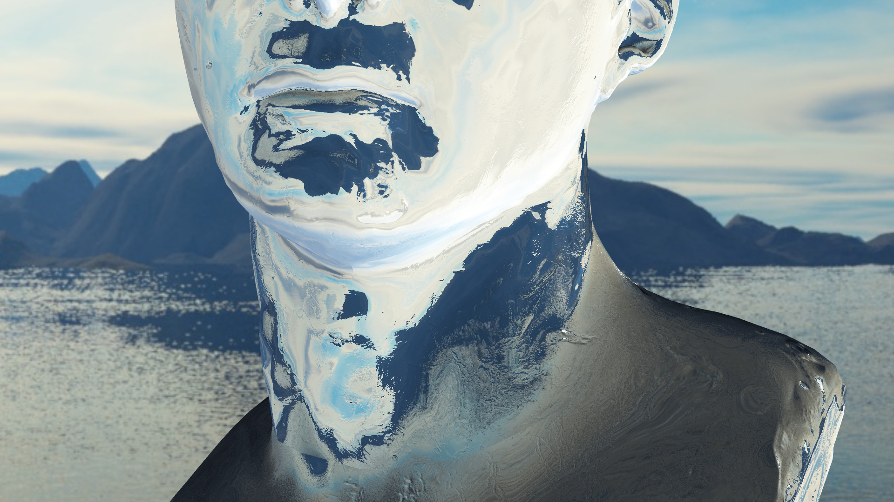
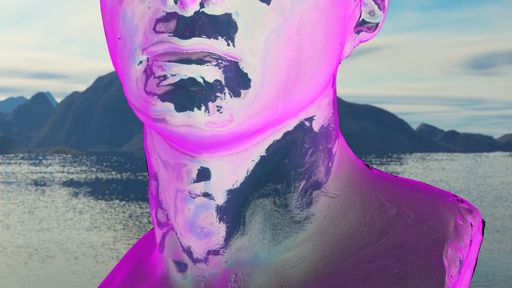
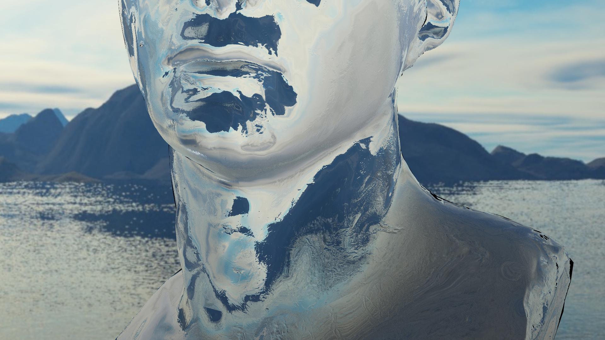
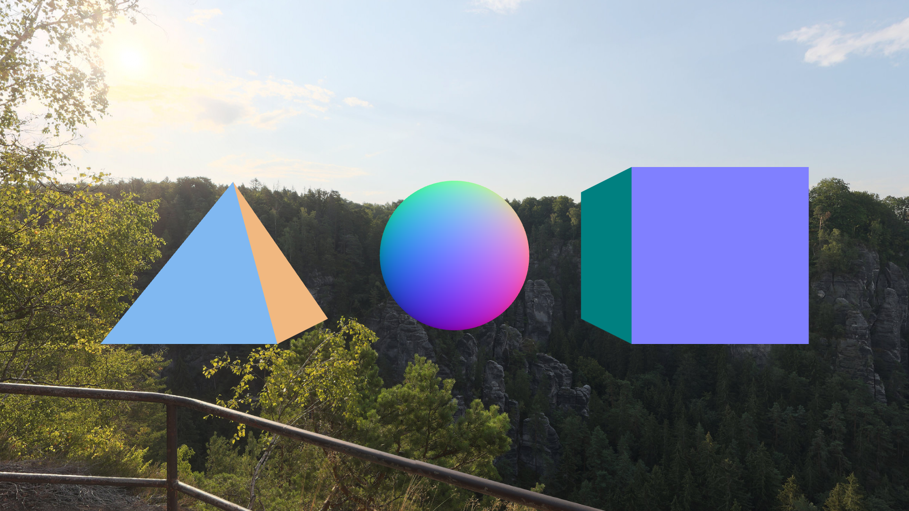
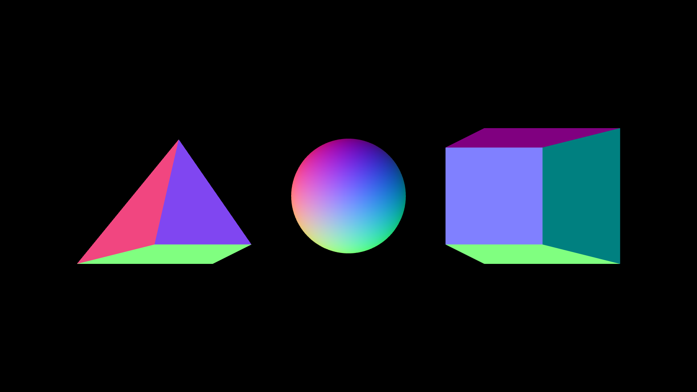
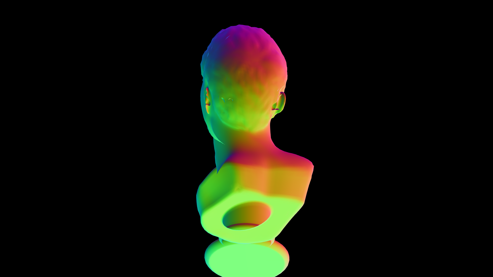
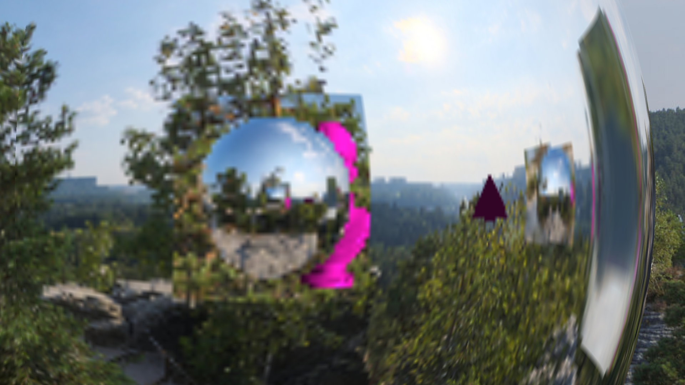

<!-- Briefly describe your project topic. -->
# Project Description

## Initial Idea

My initial idea for tis project was to create as realistic light behavior as possible. This would include light reflection, refraction, dispersion...

## Final Project
The final iteration of the project achieves most of what i sent out to achieve, however the major difference here is that it only applies these effects on light going directly into the camera. In other words the project was simplified from a global lighting, where for instace the refraction of a glass sphere would impact the light behind it, to only handle light going into the camera. The main parts of the project are shown in the subsections below:

# Results

## Reflection

{#fig:skybox-reflection width=100%}

## Refraction

## Fresnel

## Chromatic Abberition

## End result

<!-- How does your implementation achieve its goal? -->
# Implementation

My implementation relies heavily on the use of FrameBuffers. A Framebuffer is a buffer containing both depth, color and stencil, but for my project i only used the color buffer.

To create accurate reflections and refraction that include the objects in the scene, each Object has its own framebuffer. When the scene is rendered the first frame this framebuffer is empty. On each render the scene is rendered 6 times per reflective/refractive object to create a cubemap of the scene for that particular object.

:::{#fig:cubemap}
{width=16%} \  
{width=16%} \  
{width=16%} \  
{width=16%} \  
{width=16%} \  
{width=16%}

{width=16%}\  
{width=16%}\  
{width=16%}\  
{width=16%}\  
{width=16%}\  
{width=16%}

The original skybox (top) vs the dynamically created cubemap for an object (bottom).
:::

The object will then in the final render pass use this cubemap instead of the normal skybox to fetch its reflection/refractions. The great thing about this approach is that when the dynamic cubemap for this object is created the next frame, all the other objects in the scene will be using the dynamic cubemap they created the previous frame. On the scene this has the effect of light bouncing back and forth between reflective objects. This is great news as this means we essentially get infinite "ray bounces", with no additional rendering cost. Ofcourse creating a cubemap for each object isnt free, but this will be discussed in the [Advantages/Disadvantages] section.

<!-- What are some notable problems you encountered on the way? How did you solve them? -->
# Problems

## Implementation Problems

:::{#fig:back-normals}
{width=50%}\  
{width=50%}

{width=50%}\  
{width=50%}

Visualization of how the double refraction could have been implemented, had i not ran out of time.
:::

## Techincal Problems

One of the most infuriating problems for me this project was not actually realted to the project itself, but the fact that my computer (running bootcamp on MacOS), did not have proper functional drivers that did not cause a perticualr issue. This issue is that if i tried to sample a texture in a shader, the gometry would either turn black or 100% transparent. Now working with cubemaps that aessentially are textures this caused a fair deal of headaches.

<!-- What did you find out about the method in terms of its advantages, its limitations, and how
to use it effectively? -->
# Advantages/Disadvantages

<!-- Briefly mention what resources did you used to learn about the technique. No need to include
every link to everything you read, but I should get a general idea of how you figured it out,
even if the answer ends up being pure experimentation! -->
# Sources and Progress

All skyboxes and the marble bust model were downloaded from [Poly Haven]
[HDRI image](https://polyhaven.com/a/neurathen_rock_castle)